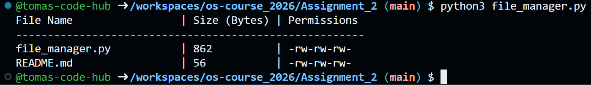

# Assignment 2: File System Interaction

**Objective:** Understand how the OS manages files, directories, and metadata using system calls and standard libraries.  
**Status:** Completed  
**Source Code:** `file_manager.py`  

---

## Report & Justification

To fulfill the requirements of interacting with the Linux file system, I developed a Python script using the built-in `os` and `stat` libraries. These modules provide a direct and efficient interface to the underlying C system calls in Linux.

Here is a breakdown of the specific functions used and the reasoning behind them:

*   **`os.listdir(path)`:** I utilized this function to iterate through the specified directory. It effectively retrieves all entries (both files and folders) within that path.
*   **`os.path.isfile(full_path)`:** Since the assignment specifically asks to retrieve characteristics for *files*, I used this method to filter out subdirectories and prevent errors during metadata extraction.
*   **`os.path.getsize(full_path)` & `os.stat(file_path)`:** These are the core functions acting as wrappers for the Linux `stat()` system call. `getsize()` quickly fetches the exact file size in bytes, while `os.stat()` pulls the comprehensive metadata object (inode data).
*   **`stat.filemode(st.st_mode)`:** Raw file permissions are returned as an integer representing the bitmask. To make this user-friendly, I passed the raw mode into `stat.filemode()`, which converts it into the standard, human-readable POSIX string format (e.g., `-rw-r--r--`).

## Proof of Execution
Below is the console output demonstrating the successful execution of the script on my Ubuntu environment, properly listing file sizes and read/write/execute permissions:

