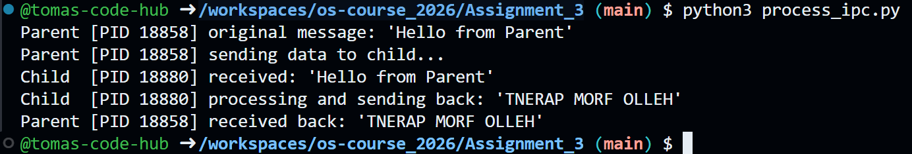

# Assignment 3: Process Creation & IPC

**Objective:** Learn how to create processes and establish Inter-Process Communication (IPC).  
**Status:** Completed  
**Source Code:** `process_ipc.py`  

---

## Report & IPC Justification

For this task, I implemented the Inter-Process Communication using a **Pipe** via Python's `multiprocessing.Pipe()` module.

**Why is a Pipe appropriate for this task?**
After evaluating different IPC mechanisms, I concluded that a Pipe is the most optimal choice for this specific scenario for the following reasons:

1. **Strict 1-to-1 Architecture:** The assignment requires communication between exactly two processes: a single parent and a single spawned child. Pipes are explicitly designed for this type of direct, point-to-point connection.
2. **Native Duplex (Two-Way) Capability:** Python's Pipe creates two connection endpoints and is bidirectional by default. This perfectly suits the requirement where the parent pushes a string through the channel, and the child pulls it, transforms it, and pushes it right back through the same channel.
3. **Low Overhead vs. Queues:** While a `Shared Queue` is excellent for complex architectures involving multiple producers or consumers (as it handles its own thread/process safety locks), it is unnecessarily heavy for this task. A Pipe is much lighter, faster, and simpler to implement for transferring small string payloads between a strict pair of processes.

## Proof of Execution

Below is the console output demonstrating the successful execution of the script. The logs clearly show the distinct Process IDs (PIDs) for both the parent and the child, proving they are running in separate memory spaces while successfully exchanging data:

