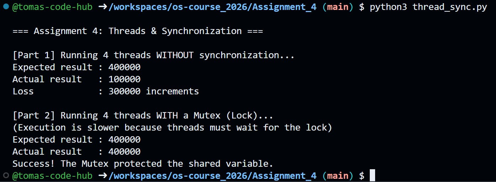

# Assignment 4: Threads & Synchronization

**Objective:** Understand concurrency, race conditions, and synchronization primitives.  
**Status:** Completed  
**Source Code:** `thread_sync.py`  

---

## Report: Concurrency & Synchronization

### 1. What is a Race Condition? (Observation from Part 1)
Based on the execution of Part 1, a **Race Condition** occurs when multiple threads access and attempt to modify the same shared variable concurrently without any coordination. 

Even though the operation `counter += 1` appears as a single line of code, at the processor level, it requires three distinct steps: **Read** the current value, **Add** 1, and **Write** the new value back. Because we had 4 threads running a massive loop (1,000,000 iterations each), the operating system constantly paused and switched between them. This caused threads to read the same old value before another thread had the chance to write its update. Consequently, thousands of increments "collided" and were overwritten, resulting in a final number far below the expected 4,000,000.

### 2. How the Mutex Solved the Problem (Observation from Part 2)
To solve this data corruption, I implemented a **Mutex** (Mutual Exclusion) using Python's `threading.Lock()`. 

A Mutex acts as a strict gateway. By wrapping the increment operation inside a `with lock:` block, I established a **Critical Section**. When Thread A reaches this section, it "acquires" the lock. If Threads B, C, or D arrive, they are physically blocked and forced to wait in a queue. Once Thread A completes the full Read-Add-Write cycle, it releases the lock for the next thread. This mechanism turns the increment into an **atomic operation** (indivisible), guaranteeing that absolutely no increments are lost, resulting in exactly 4,000,000.

---

## Proof of Execution

Below is the console output demonstrating the race condition failure followed by the synchronized success:

